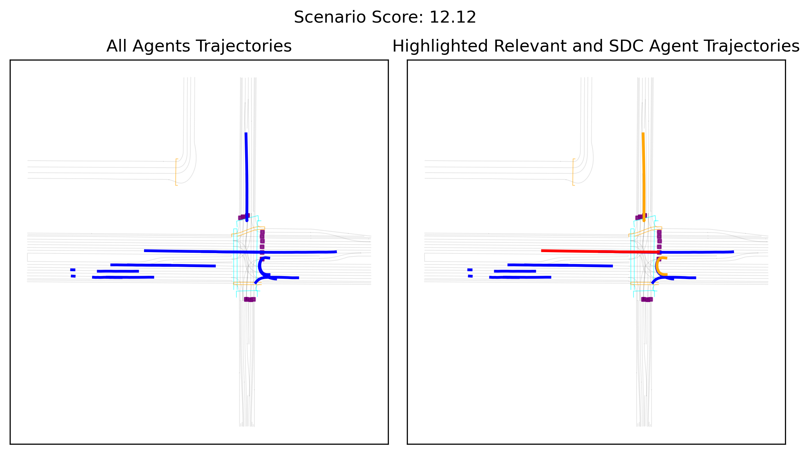

# ScenarioCharacterization (Work-in-Progress)

Generalizable automated scenario characterization for trajectory datasets. Currently, 
it is a re-implementation of the scenario characterization approach introduced in [SafeShift](https://github.com/cmubig/SafeShift).

## Pre-requisites

This repository is using: 
- [uv](https://docs.astral.sh/uv/) as package manager.
- [Hydra](https://hydra.cc/docs/intro/) for hierarchical configurations. 
- [Pydantic](https://docs.pydantic.dev/latest/) for Input/Output data validation. 

## Repository Organization 

The main configuration files are:
1. `run_processor.yaml` which is utilized for computing scenario features
and scores, and;
2. `viz_scores_pdf.yaml`, which calculates a density function over the scored scenarios and scenario visualizations. 

Both configuration files are hierarchically constructed through the following configs:
- `characterizer`: specifies what type of characterization to run. For example: features, scores, etc.
- `dataset`: specifies which dataset adapter to use. 
- `paths`: specifies paths to the input and output data.
- `processor`: specifies what type of processor to run. Currently, we support `feature` and `score` processors. 
- `viz`: specifies scenario visualization configurations.


## Dataset Adapters

The dataset adapter class is intented for converting data from a dataset-specific format into a structured representation, following the `Scenario` schema below:

```python
class Scenario(BaseModel):
    num_agents: PositiveInt
    scenario_id: str
    ego_index: NonNegativeInt
    ego_id: PositiveInt
    agent_ids: List[NonNegativeInt]
    agent_types: List[str]
    agent_valid: BooleanNDArray3D
    agent_positions: Float32NDArray3D
    agent_velocities: Float32NDArray3D
    agent_headings: Float32NDArray3D
    agent_relevance: Float32NDArray1D
    last_observed_timestep: PositiveInt
    total_timesteps: PositiveInt
    stationary_speed: float
    timestamps: Float32NDArray1D
    map_conflict_points: Float32NDArray2D | None
```

## Scenario Processors

The processor classes are designed to take a set of input scenarios and produce a specified characterization. 

### Feature processor

The feature processor takes in a feature class specified in the `characterizer` configuration and produces specialized features for a set of input scenarios specified in the `paths` configuration file. 

```bash
uv run src/run_processor.py processor=features characterizer=[feature_type]
```

Currently, we provide these feature groups, located under `config/characterizer`:
- `feature`: which computes a dummy random feature. **Only used for debugging purposes.**
- `individual_feature`: which computes a set of individual agent descriptors.
- **WIP: `interactive_feature`: which computes a set of interactive agent descriptors:**

#### Individual Features

To run this characterizer: 
```bash
uv run src/run_processor.py processor=features characterizer=individual_features
```

Currently supported features:
- Agent speed
- **WIP: Agent speed limit diff**: Difference between the agent's speed and the speed limit
- Agent acceleration 
- Agent jerk
- Agent waiting period: interval an agent is waiting near a conflict point. 
- **WIP: Agent In-Lane**: deviation from a lane
- **WIP: Trajectory Anomaly**: distance to the closest behavior primitive.

#### WIP: Interactive Features

**WIP** To run this characterizer: 
```bash
uv run src/run_processor.py processor=features characterizer=interactive_features
```

Currently supported features:
 - **WIP: Time Headway**
 - **WIP: Time to Collision**
 - **WIP: Minimum Time to Conflict Point**
 - **WIP: Collisions**
 - **WIP: Trajectory-Pair Anomaly**


## Score Processor

The scorer takes in a list of features specified in the `characterizer` configuration for a set of input scenarios specified in the `paths` configuration file, and produces a specialized score. 
```bash
uv run src/run_processor.py processor=scores characterizer=[score_type]
```

Currently, we provide these feature groups, located under `config/characterizer`:
- `scores`: which computes a dummy score from a random feature. **Only used for debugging purposes.**
- `individual_scores`: which computes agent and scenario scores out of a set of individual agent descriptors.
- **WIP: `interactive_scores`: which computes agent and scenario scores out of a set of interactive agent descriptors.**

#### Individual Scorer

To run this characterizer: 
```bash
uv run src/run_processor.py processor=scores characterizer=individual_scores
```

#### WIP: Interactive Scorer

**WIP** To run this characterizer: 
```bash
uv run src/run_processor.py processor=features characterizer=interactive_features
```

## WIP: Scenario Probing

**WIP**

## Visualizer 

The visualizer produces a density function over the scored scenarios and generates a few scenario samples across specified percentiles.
```bash
uv run src/viz_scores_pdf.py
```

<div align="center">
  
  <h5>PDF over scored scenarios.</h5>
</div>

<div align="center">
  
  <h5>Scored Scenario.</h5>
</div>


## An Example

We added a few examples under the `samples` folder and a `test.yaml` file under `config/paths` with local paths pointing to the sample data. This test will use ground truth data (`scenario_type: gt`) and compute critical features (`return_criteria: critical`). 

To assess functionality of the pipeline follow these steps:

### 1. Compute the Individual Features:
```bash
uv run src/run_processor.py processor=features characterizer=individual_features paths=test
```
This will create an `output/cache` folder containing the following temporary feature information: 
* `output/cache/conflict_points`, one file per sample scenario containing conflict regions in a given scenario. 
* `output/cache/features/gt_critical`, one file per sample scenario containing per-agent individual features.

### 2. Compute the Individual Scores:
```bash
uv run src/run_processor.py processor=scores characterizer=individual_scores paths=test
```
This will utilize the pre-computed features and generate per-agent, per-scenario scores to `output/cache/scores/gt_critical`. 

### 3. Visualize Scores and Scenarios
```bash
uv run src/viz_scores_pdf.py paths=test
```
This will generate and save a density plot over the scored scenarios to `output/cache/visualization/gt_critical/individual_scorer`.