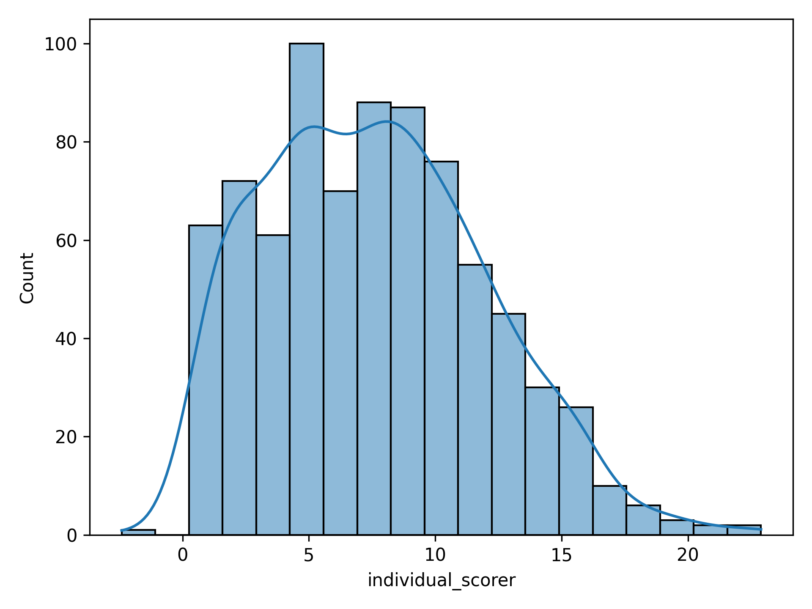

# Scenario Characterization

The processor classes are designed to take a set of input scenarios and produce the specified characterization outputs.

---

##  Feature Processor

The feature processor uses a feature class specified in the `characterizer` configuration to compute specialized features for input scenarios defined in the `paths` configuration.

**Example usage:**
```bash
uv run -m characterization.run_processor characterizer=[feature_type]
```

Available feature groups (see `config/characterizer`):
- **`individual_features`**: Computes descriptors for individual agents.
- **`interaction_features`**: Computes descriptors for agent interactions.

### Individual Features

To run the individual features characterizer:
```bash
uv run -m characterization.run_processor  characterizer=individual_features
```

Currently supported features:
- Agent speed
- Agent acceleration
- Agent jerk
- Agent waiting period (interval an agent waits near a conflict point)
- **WIP:** Agent speed limit difference (difference between agent speed and speed limit)
- **WIP:** Agent in-lane deviation
- **WIP:** Trajectory anomaly (distance to closest behavior primitive)

### Interaction Features

To run the interaction features characterizer:
```bash
uv run -m characterization.run_processor characterizer=interaction_features
```

Currently supported features:
- Collisions
- Minimum Time to Conflict Point (mTTCP)
- Time headway
- Time to collision
- Deceleration Rate to Avoid a Crash (DRAC)
- **WIP:** Trajectory-pair anomaly

---

##  Score Processor

The score processor uses a list of features specified in the `characterizer` configuration to compute specialized scores for input scenarios.

**Example usage:**
```bash
uv run -m characterization.run_processor characterizer=[score_type]
```

Available score groups (see `config/characterizer`):
- **`individual_scores`**: Computes agent and scenario scores from individual agent descriptors.
- **`interaction_scores`**: Computes agent and scenario scores from interaction descriptors.

### Individual Scorer

To run the individual scorer:
```bash
uv run -m characterization.run_processor characterizer=individual_scores
```

### Interaction Scorer

To run the interaction scorer:
```bash
uv run -m characterization.run_processor characterizer=interaction_scores
```

---

##  Scenario Probing

---

##  Visualizer

The visualizer computes a density function over scored scenarios and generates scenario samples across specified percentiles.

**Example usage:**
```bash
uv run -m characterization.viz_scores_pdf
```

### Visualizing the Density Function

<div align="center">
  
</div>

### Visualizing Scored Scenarios

<div align="center" style="display: flex; justify-content: center; gap: 32px;">
  <div style="display: inline-block; text-align: center;">
    <strong>Individual, Low Score</strong><br>
    
  </div>
  <div style="display: inline-block; text-align: center;">
    <strong>Individual, High Score</strong><br>
    
  </div>
</div>

<div align="center" style="display: flex; justify-content: center; gap: 32px;">
  <div style="display: inline-block; text-align: center;">
    <strong>Interaction, Low Score</strong><br>
    
  </div>
  <div style="display: inline-block; text-align: center;">
    <strong>Interaction, High Score</strong><br>
    
  </div>
</div>
