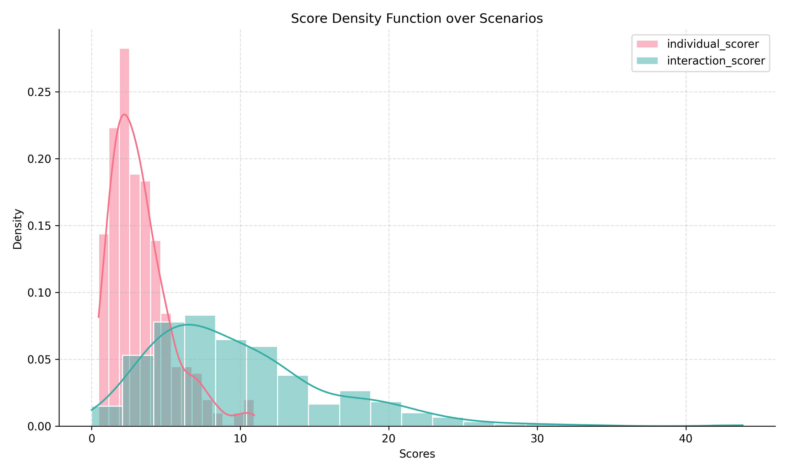

# Waymo Open Motion Dataset: Example Pipeline Usage

## Overview

This guide demonstrates how to process and analyze scenarios from the Waymo Open Motion Dataset using the provided pipeline. Both batch (Hydra-based) and single-scenario (script-based) workflows are covered.

---

## Batch Processing: Multiple Scenarios (Hydra-based)

> **Note:** Hydra is required for this workflow. For a non-Hydra example, see the section below.

### Prerequisite: Install Waymo Dependencies

```bash
uv run pip install -e ".[waymo]"
```

### 1. Obtain Sample Data

Sample files are available in the `samples` directory for quick testing.

1. **Install the [gcloud CLI](https://cloud.google.com/sdk/docs/install).**
2. **Download a sample scenario:**
   ```bash
   mkdir -p samples/raw
   cd samples/raw
   gcloud init
   gsutil -m cp -r "gs://waymo_open_dataset_motion_v_1_3_0/uncompressed/scenario/testing/testing.tfrecord-00000-of-00150" .
   ```
3. **Pre-process the data:**
   (Script adapted from [SafeShift](https://github.com/cmubig/SafeShift?tab=readme-ov-file#waymo-dataset-preparation))
   ```bash
   uv run -m characterization.utils.datasets.waymo_preprocess.py ./samples/raw ./samples/scenarios
   ```
   This will generate temporary scenario files in `samples/scenarios` for use in the pipeline. A sample config file (`test.yaml`) is provided under `config/paths` with local paths to the sample data.

   The test setup uses ground truth data (`scenario_type: gt`) and computes critical features (`return_criteria: critical`).

---

### 2. Compute Features

```bash
uv run -m characterization.run_processor processor=features characterizer=individual_features paths=test
uv run -m characterization.run_processor processor=features characterizer=interaction_features paths=test
```

This step creates a `./cache` directory with temporary feature data:
- `./cache/conflict_points`: Conflict region info per scenario.
- `./cache/features/gt_critical`: Per-agent individual features per scenario.

---

### 3. Compute Scores

```bash
uv run -m characterization.run_processor processor=scores characterizer=individual_scores paths=test
uv run -m characterization.run_processor processor=scores characterizer=interaction_scores paths=test
uv run -m characterization.run_processor processor=scores characterizer=safeshift_scores paths=test
```

This uses the computed features to generate per-agent and per-scenario scores, saved in `./cache/scores/gt_critical`.

---

### 4. Visualize Scores and Scenarios

```bash
uv run -m characterization.viz_scores_pdf paths=test
```

This generates and saves a density plot of scenario scores to:
- `./cache/visualization/gt_critical/score_density_plot.png`

It also creates scenario visualizations in:
- `./cache/visualization/gt_critical/individual_scores`
- `./cache/visualization/gt_critical/interaction_scores`

<div align="center">
  
</div>

---

## Single Scenario Processing (No Hydra)

A reference script to compute features and scores for a single scenario is provided in the `examples` folder. This assumes scenarios and conflict points have already been computed (see step 1 above for data setup).

Run the script as follows:

```bash
uv run -m characterization.examples.run_single_scenario
```
