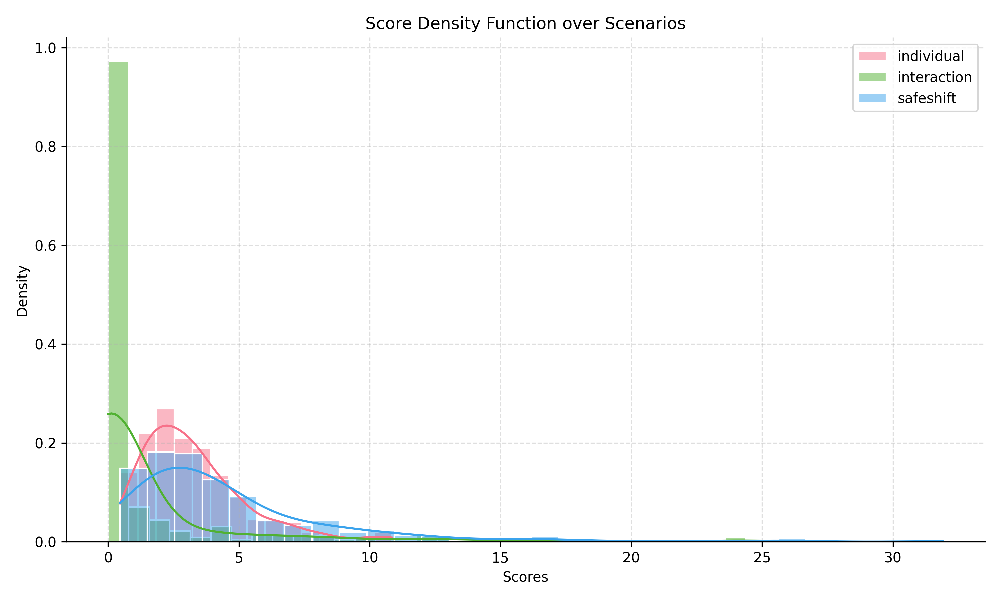

## Example: Using WOMD

To test the pipeline functionality, follow these steps:

### Pre-requisite: Install waymo dependencies
```bash
uv run pip install -e ".[waymo]"
```

### 1. Get Sample Data

Sample files will be provided under the `samples` directory for basic pipeline testing.

1. **Install the [gcloud CLI](https://cloud.google.com/sdk/docs/install).**

2. **Download a sample scenario:**
   ```bash
   mkdir -p samples/raw
   cd samples/raw
   gcloud init
   gsutil -m cp -r "gs://waymo_open_dataset_motion_v_1_3_0/uncompressed/scenario/testing/testing.tfrecord-00000-of-00150" .
   ```

3. **Pre-process the data**
   (Script adapted from [SafeShift](https://github.com/cmubig/SafeShift?tab=readme-ov-file#waymo-dataset-preparation)):
   ```bash
   uv run -m characterization.utils.datasets.waymo_preprocess.py ./samples/raw ./samples/scenarios
   ```
   This will create temporary scenario files under `samples/scenarios` for use by the pipeline.
   A `test.yaml` file is also provided under `config/paths` with local paths pointing to the sample data.

   This test uses ground truth data (`scenario_type: gt`) and computes critical features (`return_criteria: critical`).

---

### 2. Compute Features

```bash
uv run -m characterization.run_processor processor=features characterizer=individual_features paths=test
uv run -m characterization.run_processor processor=features characterizer=interaction_features paths=test
```

This will create a `./cache` directory containing temporary feature data:
- `./cache/conflict_points`: One file per scenario with conflict region information.
- `./cache/features/gt_critical`: One file per scenario with per-agent individual features.

---

### 3. Compute Scores

```bash
uv run -m characterization.run_processor processor=scores characterizer=individual_scores paths=test
uv run -m characterization.run_processor processor=scores characterizer=interaction_scores paths=test
```

This step uses the pre-computed features to generate per-agent and per-scenario scores, saved to `./cache/scores/gt_critical`.

---

### 4. Visualize Scores and Scenarios

```bash
uv run -m characterization.viz_scores_pdf paths=test
```

This will generate and save a density plot of the scored scenarios to
`./cache/visualization/gt_critical/score_density_plot.png`.
It will also create scenario visualizations in:
- `./cache/visualization/gt_critical/individual_scores`
- `./cache/visualization/gt_critical/interaction_scores`

<div align="center">
  
</div>
