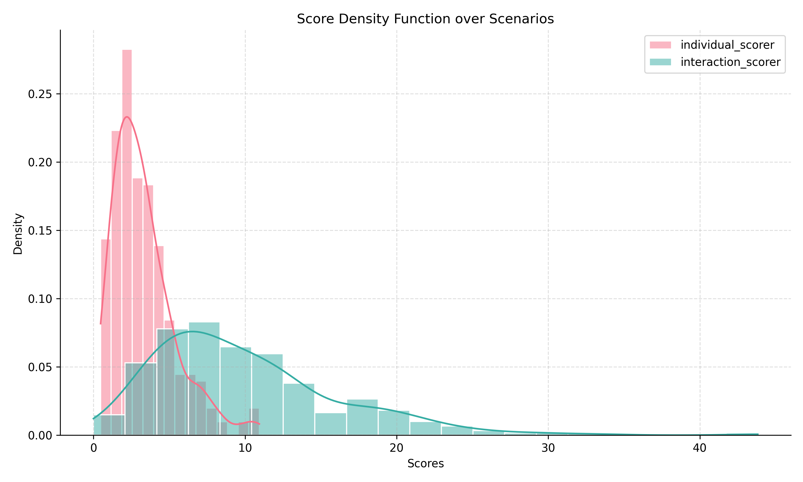

# Waymo Open Motion Dataset: Example Pipeline Usage

## Overview

This guide demonstrates how to process and analyze scenarios from the Waymo Open Motion Dataset using the provided pipeline. Both batch (Hydra-based) and single-scenario (script-based) workflows are covered.

---

## Batch Processing: Multiple Scenarios (Hydra-based)

> **Note:** Hydra is required for this workflow. For a non-Hydra example, see the section below.

### Prerequisite: Install Waymo Dependencies

To process the Waymo dataset `python 3.10` is required, it can be pinned with `uv`.

```bash
uv python pin 3.10
uv venv
uv pip install -e ".[waymo]"
```

If conda is installed and active, in order to make `uv` work the environment has to be sourced.

```bash
uv python pin 3.10
uv venv
source .venv/bin/activate
uv pip install -e ".[waymo]"
```

Or deactivate conda first.

```bash
conda deactivate
```

### 1. Obtain Sample Data

Sample files are available in the `samples` directory for quick testing.

1. **Install the [gcloud CLI](https://cloud.google.com/sdk/docs/install).**

2. **Register and accept Waymo's terms of use** at the [Waymo Dataset Site](https://waymo.com/open/) using the same Google account you registered for Google Cloud.

3. **Give your Google Cloud user Cloud Storage permissions.**

4. **Download a sample scenario:**
   ```bash
   mkdir -p samples/raw
   cd samples/raw
   gcloud init
   gsutil -m cp -r "gs://waymo_open_dataset_motion_v_1_3_0/uncompressed/scenario/training/training.tfrecord-00000-of-01000" .
   ```

5. **Pre-process the data:**
   (Script adapted from [SafeShift](https://github.com/cmubig/SafeShift?tab=readme-ov-file#waymo-dataset-preparation))

   ```bash
   uv run python -m characterization.datasets.waymo_preprocess ./samples/raw ./samples/
   ```
   This will generate temporary scenario files in `samples/scenarios` for use in the pipeline. A sample config file (`waymo_sample.yaml`) is provided under `config/paths` with local paths to the sample data.

   The test setup uses ground truth data (`scenario_type: gt`) and computes critical features (`return_criterion: critical`).

---

### 2. Compute Features

For this section `python 3.12` is required, pin it with `uv`. Make sure to have the base dependencies installed.

```bash
uv python pin 3.12
uv sync
```

If conda is installed and active, source the environment first.

```bash
deactivate # if the uv environment is active
uv python pin 3.12
uv venv
source .venv/bin/activate
uv sync
```

```bash
uv run python -m characterization.run_processor characterizer=individual_features paths=waymo_sample
uv run python -m characterization.run_processor characterizer=interaction_features paths=waymo_sample
```

This step creates a `./cache` directory with temporary feature data:
- `./cache/conflict_points`: Conflict region info per scenario.
- `./cache/features/gt_critical`: Per-agent individual features per scenario.

---

### 3. Compute Scores

```bash
uv run python -m characterization.run_processor characterizer=individual_scores paths=waymo_sample
uv run python -m characterization.run_processor characterizer=interaction_scores paths=waymo_sample
uv run python -m characterization.run_processor characterizer=safeshift_scores paths=waymo_sample
```

This uses the computed features to generate per-agent and per-scenario scores, saved in `./cache/scores/gt_critical`.

---

### 4. Analyze and Visualize Scores

To visualize the scenarios the viz dependencies are required. Install them with:

```bash
uv pip install -e ".[viz]"
```

**Score analysis** — generates score density plots, a `scene_to_scores_mapping.csv`, and OOD split files:

```bash
uv run python -m characterization.run_score_analysis paths=waymo_sample
```

Outputs are written to a timestamped folder under `./cache/analysis/`.

**Scenario visualization** (optional) — renders per-scenario visual outputs:

```bash
uv run python -m characterization.run_scenario_viz paths=waymo_sample
```

Outputs are written to `./cache/analysis/scenario_viz/`.

<div align="center">
  
</div>

---

## Single Scenario Processing (No Hydra)

A reference script to compute features and scores for a single scenario is provided in the `examples` folder. This assumes scenarios and conflict points have already been computed (see step 1 above for data setup).

Run the script as follows:

```bash
uv run python -m characterization.examples.run_single_scenario
```
